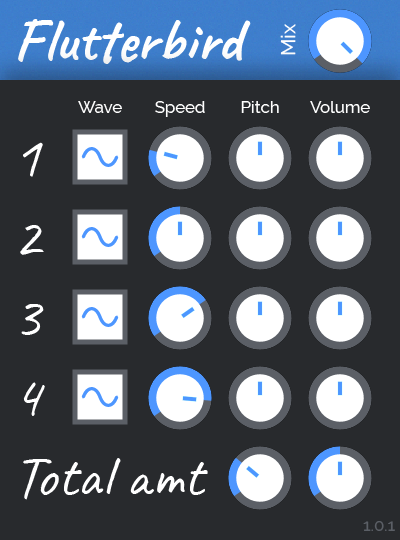

# Flutterbird

Flutterbird is a free, open-source effect plugin for adding pitch and volume fluctuation to incoming audio. It can be used for traditional wow/flutter effects as well as more chaotic, extreme modulation. Flutterbird has four separate oscillators with adjustable speeds that can be mapped to either pitch or volume.

## Contributing

Feel free to give feedback on design, report bugs, make pull requests, etc. I like all sorts of involvement!

### Building Flutterbird

1. Clone [wdl-ol](https://github.com/olilarkin/wdl-ol).
2. Add the necessary include files for the build targets you want to use. See [Martin Finke's tutorial](http://www.martin-finke.de/blog/articles/audio-plugins-002-setting-up-wdl-ol/) for more information.
3. Clone the flutterbird repo into the wdl-ol base directory.
4. Open Flutterbird.sln in Visual Studio and build the project for the desired target.
